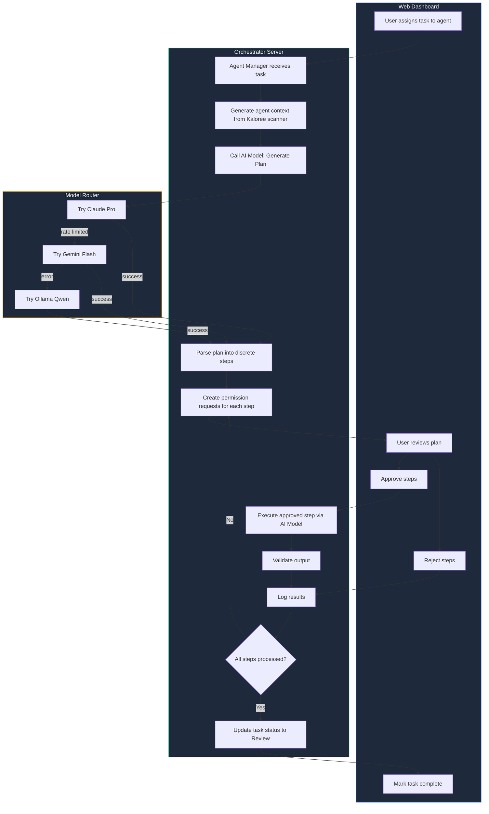
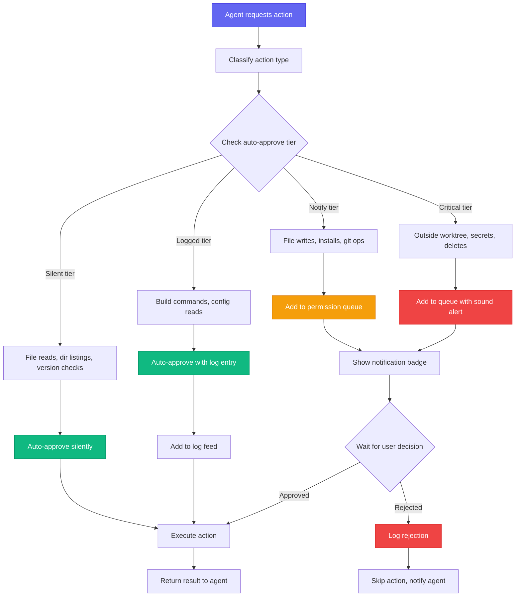
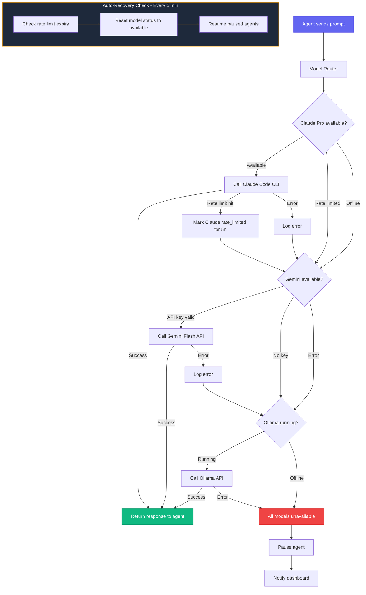
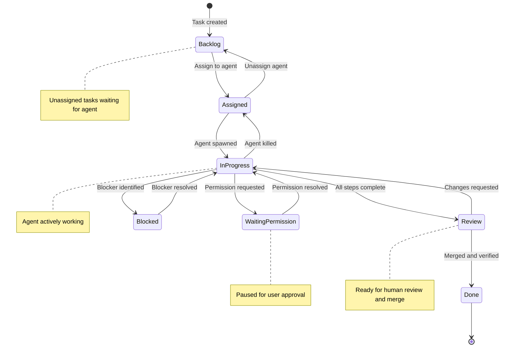
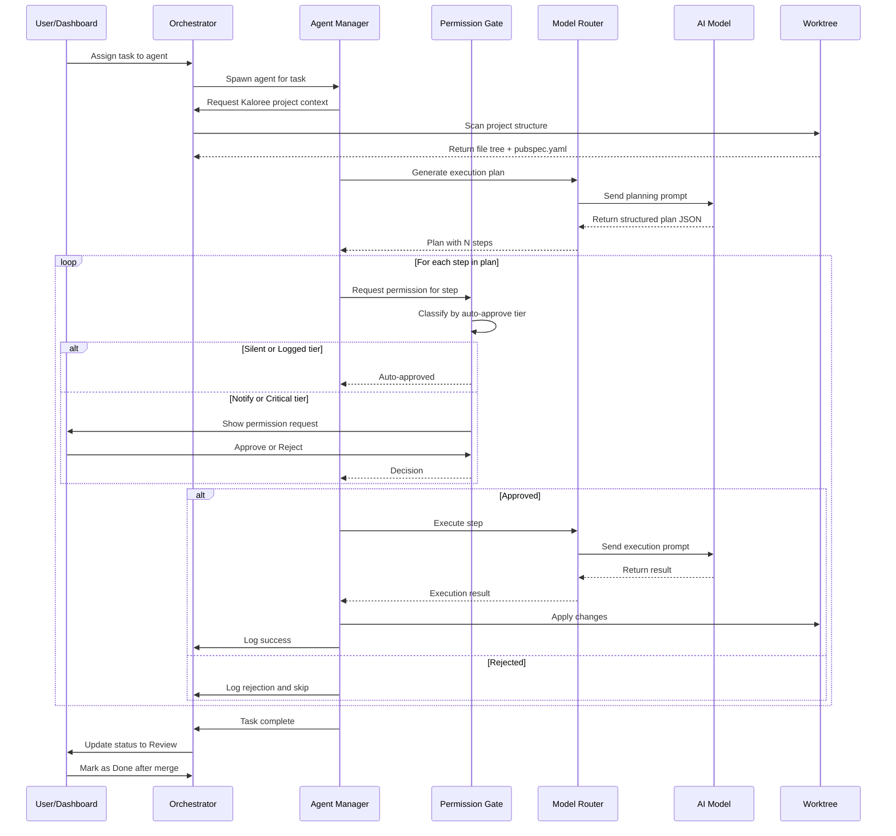

# Kaloree Agent Orchestrator — MVP Architecture Plan

## Overview

A local-first agent orchestrator with a web dashboard that manages multiple AI coding agents working in parallel on the Kaloree Flutter app.

**Orchestrator Location:** `/Users/sunit/Documents/kaloree-orchestrator/`
**Kaloree App Location:** `/Users/sunit/Documents/Kaloree/`

---

## Key Decisions

### 1. Naming Convention
- **App Name:** Kaloree (not NutriSnap)
- **Orchestrator:** `kaloree-orchestrator`
- **Worktrees:** `kaloree-ns-backend`, `kaloree-ns-data`, `kaloree-ns-flutter`

### 2. AI Model Configuration
All three models available with failover priority:
```
1. Claude Pro (via Claude Code CLI --print mode)
2. Gemini Flash 2.0 (via API with user's key)
3. Ollama Qwen 2.5 Coder 7B (local fallback)
```

### 3. Agent Invocation Pattern
**NOT stream interception.** Use task-per-invocation pattern:

```
┌─────────────────────────────────────────────────────────────┐
│  ORCHESTRATOR-CONTROLLED LOOP                                │
├─────────────────────────────────────────────────────────────┤
│                                                              │
│  1. claude --print "Analyze task and output a PLAN as JSON"  │
│     └─→ Agent outputs structured plan                        │
│                                                              │
│  2. Orchestrator parses plan into discrete steps             │
│     └─→ Each step becomes a permission request               │
│                                                              │
│  3. User batch-approves/rejects steps from dashboard         │
│                                                              │
│  4. For each approved step:                                  │
│     claude --print "Execute step N: [specific instruction]"  │
│     └─→ Agent executes single step                           │
│     └─→ Orchestrator validates output                        │
│     └─→ Repeat until plan complete                           │
│                                                              │
└─────────────────────────────────────────────────────────────┘
```

### 4. Permission Auto-Approve Tiers

| Tier | Action | Behavior |
|------|--------|----------|
| **Silent** | File reads within worktree | Auto-approve, no log entry |
| **Silent** | Directory listings within worktree | Auto-approve, no log entry |
| **Silent** | Version checks `--version`, `--help` | Auto-approve, no log entry |
| **Silent** | `git status`, `git log`, `git diff` within worktree | Auto-approve, no log entry |
| **Logged** | Build/test commands `flutter analyze`, `dart test` | Auto-approve, appears in log feed |
| **Logged** | Reading config files `pubspec.yaml`, `package.json` | Auto-approve, appears in log feed |
| **Notify** | Any file write/modify | Requires approval, notification badge |
| **Notify** | Any package install | Requires approval, notification badge |
| **Notify** | Shell commands not in auto-approve list | Requires approval, notification badge |
| **Notify** | Any `git commit/push` | Requires approval, notification badge |
| **Critical** | Files outside agent's worktree | Requires approval, sound alert |
| **Critical** | System-level installs | Requires approval, sound alert |
| **Critical** | Anything touching `.env`, secrets, API keys | Requires approval, sound alert |
| **Critical** | Deleting files | Requires approval, sound alert, NEVER auto-approvable |

### 5. Agent Priority & Branches

| Priority | Agent | Branch | Worktree | Initial Task |
|----------|-------|--------|----------|--------------|
| **P0** | Backend Architect | `feature/backend` | `kaloree-ns-backend` | Firebase Auth + Firestore schema |
| **P0** | Data Engineer | `feature/data-pipeline` | `kaloree-ns-data` | USDA API + fuzzy search |
| **P1** | Flutter UI | `feature/ui-updates` | `kaloree-ns-flutter` | Weekly insights screen (after P0 PRs) |

---

## Detailed Workflow Diagrams

### 1. Agent Task Execution Flow

This diagram shows how a task moves from assignment to completion using the task-per-invocation pattern.



### 2. Permission Evaluation Flow

This diagram shows how the Permission Gate processes requests using the auto-approve tier system.



### 3. Model Failover Flow

This diagram shows how the Model Router handles failover between AI models.



### 4. Task Lifecycle State Machine

This diagram shows all possible states and transitions for a task.



### 5. Complete Agent Execution Sequence

This sequence diagram shows the detailed interaction between all components during task execution.



---

## Architecture Diagram

```
┌─────────────────────────────────────────────────────────────────┐
│                     WEB DASHBOARD                                │
│                 React + Vite + Tailwind                          │
│                   localhost:3000                                 │
│                                                                  │
│  ┌───────────┐ ┌───────────┐ ┌───────────┐ ┌─────────────────┐  │
│  │  Agents   │ │   Tasks   │ │Permissions│ │ Logs / Settings │  │
│  │  Panel    │ │   Board   │ │  Center   │ │    / Repo       │  │
│  └───────────┘ └───────────┘ └───────────┘ └─────────────────┘  │
└────────────────────────┬────────────────────────────────────────┘
                         │ WebSocket + REST API
                         ↓
┌─────────────────────────────────────────────────────────────────┐
│                   ORCHESTRATOR SERVER                            │
│                Node.js + Express + ws                            │
│                   localhost:4000                                 │
│                                                                  │
│  ┌──────────────┐  ┌──────────────┐  ┌──────────────────────┐   │
│  │  Permission  │  │    Model     │  │   Agent Manager      │   │
│  │    Gate      │  │   Router     │  │  spawn/kill/monitor  │   │
│  │              │  │              │  │                      │   │
│  │ Auto-approve │  │ Claude Pro   │  │ ┌──────────────────┐ │   │
│  │ tiers +      │  │     ↓        │  │ │ Claude Runner    │ │   │
│  │ queue        │  │ Gemini Flash │  │ │ --print mode     │ │   │
│  │              │  │     ↓        │  │ └──────────────────┘ │   │
│  │              │  │ Ollama Qwen  │  │ ┌──────────────────┐ │   │
│  │              │  │              │  │ │ Gemini Runner    │ │   │
│  │              │  │              │  │ └──────────────────┘ │   │
│  │              │  │              │  │ ┌──────────────────┐ │   │
│  │              │  │              │  │ │ Ollama Runner    │ │   │
│  └──────────────┘  └──────────────┘  │ └──────────────────┘ │   │
│                                      └──────────────────────┘   │
│  ┌──────────────┐  ┌──────────────┐  ┌──────────────────────┐   │
│  │  Dependency  │  │  Worktree    │  │   Kaloree Scanner    │   │
│  │   Checker    │  │  Manager     │  │  project structure   │   │
│  └──────────────┘  └──────────────┘  └──────────────────────┘   │
│                                                                  │
│  ┌──────────────────────────────────────────────────────────┐   │
│  │                    SQLite Database                        │   │
│  │   agents | tasks | permissions | logs | model_status      │   │
│  └──────────────────────────────────────────────────────────┘   │
└─────────────────────────────────────────────────────────────────┘
                         │
         ┌───────────────┼───────────────┐
         ↓               ↓               ↓
┌──────────────┐ ┌──────────────┐ ┌──────────────┐
│    Agent:    │ │    Agent:    │ │    Agent:    │
│   Backend    │ │  Data Eng    │ │  Flutter UI  │
│  Architect   │ │              │ │              │
│              │ │              │ │              │
│  Worktree:   │ │  Worktree:   │ │  Worktree:   │
│  kaloree-    │ │  kaloree-    │ │  kaloree-    │
│  ns-backend  │ │  ns-data     │ │  ns-flutter  │
│              │ │              │ │              │
│  Branch:     │ │  Branch:     │ │  Branch:     │
│  feature/    │ │  feature/    │ │  feature/    │
│  backend     │ │  data-       │ │  ui-updates  │
│              │ │  pipeline    │ │              │
└──────┬───────┘ └──────┬───────┘ └──────┬───────┘
       │                │                │
       └────────────────┼────────────────┘
                        ↓
              ┌─────────────────────┐
              │    KALOREE REPO     │
              │    main branch      │
              │                     │
              │ /Users/sunit/       │
              │ Documents/Kaloree   │
              │                     │
              │ Agents work in      │
              │ their own worktrees │
              │ Developer merges    │
              │ when ready          │
              └─────────────────────┘
```

---

## Directory Structure

```
/Users/sunit/Documents/
├── Kaloree/                          ← Existing Flutter app main repo
├── kaloree-ns-backend/               ← Git worktree → feature/backend
├── kaloree-ns-data/                  ← Git worktree → feature/data-pipeline
├── kaloree-ns-flutter/               ← Git worktree → feature/ui-updates
│
└── kaloree-orchestrator/             ← NEW - This project
    ├── package.json
    ├── vite.config.js
    ├── .env                          ← KALOREE_ROOT + API keys
    ├── .gitignore
    ├── orchestrator.db               ← SQLite gitignored
    │
    ├── server/
    │   ├── index.js                  ← Express + WebSocket port 4000
    │   ├── db.js                     ← SQLite schema + queries
    │   ├── agent-manager.js          ← Spawn/kill/monitor agents
    │   ├── model-router.js           ← Claude → Gemini → Ollama
    │   ├── permission-gate.js        ← Auto-approve tiers + queue
    │   ├── dependency-checker.js     ← Pre-install verification
    │   ├── worktree-manager.js       ← Git worktree ops
    │   ├── kaloree-scanner.js        ← Scan project structure
    │   └── runners/
    │       ├── claude-runner.js      ← Claude Code CLI --print
    │       ├── gemini-runner.js      ← Gemini API wrapper
    │       └── ollama-runner.js      ← Ollama API wrapper
    │
    ├── src/
    │   ├── App.jsx                   ← Main dashboard layout
    │   ├── main.jsx                  ← Entry point
    │   ├── index.css                 ← Tailwind imports
    │   │
    │   ├── components/
    │   │   ├── Navbar.jsx            ← Model status + notifications
    │   │   ├── AgentPanel.jsx        ← Agent cards with controls
    │   │   ├── TaskBoard.jsx         ← Kanban columns
    │   │   ├── PermissionCenter.jsx  ← Approval cards with diffs
    │   │   ├── LogStream.jsx         ← Real-time log feed
    │   │   ├── RepoStatus.jsx        ← Kaloree repo health
    │   │   └── Settings.jsx          ← Config UI
    │   │
    │   ├── hooks/
    │   │   └── useWebSocket.js       ← WebSocket connection
    │   │
    │   └── lib/
    │       └── utils.js              ← Shared helpers
    │
    ├── templates/
    │   └── agent-context.md          ← Per-agent context template
    │
    └── scripts/
        └── setup.sh                  ← Initial setup script
```

---

## Database Schema

```sql
-- Agents registered in the system
CREATE TABLE agents (
  id TEXT PRIMARY KEY,
  name TEXT NOT NULL,
  icon TEXT DEFAULT '🤖',
  color TEXT DEFAULT '#6366F1',
  status TEXT DEFAULT 'idle',          -- idle | running | paused | error | waiting_permission
  worktree_path TEXT,
  branch TEXT,
  current_model TEXT DEFAULT 'claude-pro',
  current_task_id TEXT,
  pid INTEGER,                          -- OS process ID when running
  created_at DATETIME DEFAULT CURRENT_TIMESTAMP,
  last_active DATETIME
);

-- Task board
CREATE TABLE tasks (
  id TEXT PRIMARY KEY,
  title TEXT NOT NULL,
  description TEXT,
  agent_id TEXT,                        -- assigned agent NULL = unassigned
  status TEXT DEFAULT 'backlog',        -- backlog | assigned | in_progress | blocked | review | done
  priority TEXT DEFAULT 'P1',           -- P0 | P1 | P2
  category TEXT,                        -- backend | data | flutter | ai
  blockers TEXT,                        -- JSON array of blocker descriptions
  branch TEXT,
  commits_count INTEGER DEFAULT 0,
  created_at DATETIME DEFAULT CURRENT_TIMESTAMP,
  started_at DATETIME,
  completed_at DATETIME
);

-- Permission requests from agents
CREATE TABLE permissions (
  id TEXT PRIMARY KEY,
  agent_id TEXT NOT NULL,
  type TEXT NOT NULL,                   -- command | file_write | file_delete | install | script | git
  action TEXT NOT NULL,                 -- The actual command or file path
  description TEXT,                     -- Human-readable explanation
  diff TEXT,                            -- For file changes: the diff content
  status TEXT DEFAULT 'pending',        -- pending | approved | rejected | auto_approved
  risk_level TEXT DEFAULT 'medium',     -- low | medium | high | critical
  auto_approve_tier TEXT,               -- silent | logged | notify | critical
  is_project_file INTEGER DEFAULT 1,    -- 1 = inside worktree, 0 = outside
  created_at DATETIME DEFAULT CURRENT_TIMESTAMP,
  resolved_at DATETIME,
  resolved_by TEXT                      -- user | auto
);

-- Agent activity logs
CREATE TABLE logs (
  id INTEGER PRIMARY KEY AUTOINCREMENT,
  agent_id TEXT NOT NULL,
  level TEXT DEFAULT 'info',            -- info | warn | error | success | permission
  message TEXT NOT NULL,
  metadata TEXT,                        -- JSON blob for extra context
  created_at DATETIME DEFAULT CURRENT_TIMESTAMP
);

-- Model usage and health tracking
CREATE TABLE model_status (
  id INTEGER PRIMARY KEY AUTOINCREMENT,
  model TEXT NOT NULL UNIQUE,           -- claude-pro | gemini-flash | ollama-qwen
  status TEXT DEFAULT 'available',      -- available | rate_limited | error | offline
  requests_today INTEGER DEFAULT 0,
  last_error TEXT,
  rate_limited_until DATETIME,
  updated_at DATETIME DEFAULT CURRENT_TIMESTAMP
);

-- Dependency registry
CREATE TABLE dependencies (
  id INTEGER PRIMARY KEY AUTOINCREMENT,
  name TEXT NOT NULL,
  version TEXT,
  type TEXT NOT NULL,                   -- system | npm | pip | dart | brew
  scope TEXT DEFAULT 'project',         -- project | global
  worktree TEXT,                        -- which worktree this is for
  installed_by TEXT,                    -- agent_id or pre-existing
  checked_at DATETIME DEFAULT CURRENT_TIMESTAMP
);

-- Settings key-value store
CREATE TABLE settings (
  key TEXT PRIMARY KEY,
  value TEXT,
  updated_at DATETIME DEFAULT CURRENT_TIMESTAMP
);
```

---

## API Endpoints

### Agents
```
GET    /api/agents              — List all agents
POST   /api/agents              — Create new agent
PATCH  /api/agents/:id          — Update agent
POST   /api/agents/:id/spawn    — Start agent process
POST   /api/agents/:id/kill     — Stop agent process
POST   /api/agents/:id/pause    — Pause agent
POST   /api/agents/:id/resume   — Resume agent
```

### Tasks
```
GET    /api/tasks               — List tasks filterable by status, agent, category
POST   /api/tasks               — Create task
PATCH  /api/tasks/:id           — Update task
DELETE /api/tasks/:id           — Delete task
```

### Permissions
```
GET    /api/permissions         — List permissions filterable by status
POST   /api/permissions/:id/resolve — Approve or reject
```

### Logs
```
GET    /api/logs                — Query logs filterable by agent, level, time
```

### Models
```
GET    /api/models              — Get model statuses
POST   /api/models/check        — Force health check
```

### Repository
```
GET    /api/repo/status         — Kaloree repo status
GET    /api/repo/branches       — List all branches
POST   /api/repo/worktree       — Create a worktree
DELETE /api/repo/worktree/:name — Remove a worktree
GET    /api/repo/scan           — Re-scan project structure
```

### Settings
```
GET    /api/settings            — Get current settings
PATCH  /api/settings            — Update settings
```

---

## WebSocket Events

### Server → Dashboard
```javascript
// Agent status changed
{ type: "agent_status", agentId, status, model }

// New permission request
{ type: "permission_request", permission: { id, agentId, type, action, description, diff, riskLevel } }

// Permission resolved
{ type: "permission_resolved", permissionId, status }

// Agent log entry
{ type: "agent_log", agentId, level, message, timestamp }

// Model status changed
{ type: "model_status", model, status, until }

// Task updated
{ type: "task_update", taskId, status, agentId }
```

### Dashboard → Server
```javascript
// Approve/reject permission
{ type: "resolve_permission", permissionId, status, comment }

// Agent control
{ type: "agent_control", agentId, action: "spawn" | "kill" | "pause" | "resume" }

// Task operations
{ type: "task_create", task }
{ type: "task_update", taskId, updates }
{ type: "task_delete", taskId }

// Settings update
{ type: "settings_update", settings }
```

---

## MVP Dependencies

### package.json
```json
{
  "name": "kaloree-orchestrator",
  "version": "0.1.0",
  "type": "module",
  "scripts": {
    "dev": "concurrently \"npm run server\" \"npm run client\"",
    "server": "node server/index.js",
    "client": "vite",
    "build": "vite build"
  },
  "dependencies": {
    "better-sqlite3": "^11.0.0",
    "cors": "^2.8.5",
    "dotenv": "^16.4.0",
    "express": "^4.18.2",
    "uuid": "^9.0.0",
    "ws": "^8.16.0",
    "@google/generative-ai": "^0.21.0"
  },
  "devDependencies": {
    "@types/better-sqlite3": "^7.6.8",
    "@vitejs/plugin-react": "^4.2.0",
    "autoprefixer": "^10.4.17",
    "concurrently": "^8.2.0",
    "postcss": "^8.4.33",
    "tailwindcss": "^3.4.1",
    "vite": "^5.0.0"
  }
}
```

### React Dependencies in package.json
```json
{
  "dependencies": {
    "react": "^18.2.0",
    "react-dom": "^18.2.0",
    "lucide-react": "^0.312.0",
    "clsx": "^2.1.0",
    "tailwind-merge": "^2.2.0"
  }
}
```

---

## Initial Tasks to Seed

### P0 - Backend Architect
```
Title: Firebase Auth Setup
Description: |
  Set up Firebase Authentication for Kaloree app.
  
  Requirements:
  1. Add firebase_auth and firebase_core packages to pubspec.yaml
  2. Create lib/services/auth_service.dart with:
     - Sign in with Google
     - Sign in with Apple optional
     - Sign out
     - Auth state stream
  3. Create lib/models/user_model.dart
  4. Update lib/main.dart to initialize Firebase
  5. Add Firebase config files android/app/google-services.json placeholder
  
  Do NOT actually configure Firebase project - just set up the code structure.
Priority: P0
Category: backend
```

### P0 - Data Engineer
```
Title: USDA FoodData Central API Integration
Description: |
  Integrate USDA FoodData Central API for food search fallback.
  
  Requirements:
  1. Create lib/services/usda_api_service.dart with:
     - Search foods by query
     - Get food details by FDC ID
     - Parse nutrition data
  2. Create lib/models/usda_food.dart model
  3. Implement fuzzy search for Indian food name variations
  4. Add caching layer to reduce API calls
  5. Handle offline gracefully - fall back to local DB
  
  API docs: https://fdc.nal.usda.gov/api-guide.html
  User will provide API key in .env
Priority: P0
Category: data
```

---

## Deferred to Post-MVP

- Daily report generation
- ntfy.sh push notifications
- Sound alerts for critical permissions
- Keyboard shortcuts A = approve, R = reject
- Mobile-responsive optimization
- Cron integration for scheduled reports
- Multiple dashboard tabs open sync

---

## Next Steps

1. **Switch to Code mode** to begin implementation
2. Start with Phase 0 - Repository Setup
3. Work through each phase sequentially
4. Test after each phase before moving to next

---

## Questions Resolved

| Question | Decision |
|----------|----------|
| App name | Kaloree |
| Orchestrator location | `/Users/sunit/Documents/kaloree-orchestrator/` |
| AI models | All 3: Claude CLI, Gemini API, Ollama |
| Agent invocation | `--print` mode, task-per-invocation |
| Permission system | Tiered auto-approve |
| Initial agents | Backend + Data P0, Flutter P1 |
| Feature branches | Create fresh, don't exist yet |
